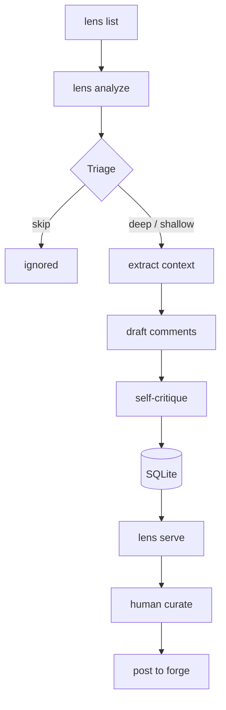

# 🔍 Lens — The Local PR Review Agent

<p align="center">
  <b>Local-first. AI-assisted. Human-in-the-loop.</b><br>
  Draft, curate, and post pull request reviews without leaving your terminal.
</p>

---

**Lens** is a local CLI + lightweight browser UI that drafts inline pull-request review comments using the AI CLI you already use (Claude Code, Gemini CLI, etc.), lets you curate them on `localhost`, and posts them to GitHub or Bitbucket — all without your code, diffs, or credentials ever leaving your machine.

## 📑 Table of Contents
- [🧠 Philosophy](#-philosophy)
- [🎯 Who It's For](#-who-its-for)
- [⚡ What It Does](#-what-it-does)
- [💻 Resource Footprint](#-resource-footprint)
- [🚀 Quick Setup](#-quick-setup)
- [🛠️ Core Commands](#️-core-commands)
- [🏗️ How It Works](#️-how-it-works)
- [📚 Documentation](#-documentation)

---

## 🧠 Philosophy

### 🔒 Local-first & private
Your code, your credentials, and your config stay on your machine. The only network traffic is (1) the diff fetch from your forge and (2) the LLM calls made by **your** authenticated provider CLI — Lens itself has no servers, no telemetry, no cloud. All state lives in `~/.lens/lens.db` (SQLite).

### 🧑‍💻 Human-in-the-loop
AI is a powerful assistant, but **you** are the senior engineer. Lens never auto-posts. It drafts comments, self-critiques to prune low-confidence noise, and hands you the result in a curation UI. You accept, edit, or reject — and only what you choose ships.

### 📚 Learns your voice over time
Every edit you make to an AI draft is captured (`ai_original_body` vs `current_body`). Every rejection records a reason. This becomes a personal corpus of your review style — exportable as JSONL for fine-tuning, or replayable as few-shot examples on future reviews.

### 🔌 Zero lock-in, zero subscriptions
No SaaS, no webhooks, no background daemons. Lens wraps the LLM CLI you already pay for (Claude/Gemini/Codex). Stop using Lens tomorrow and the only thing you lose is a SQLite file you can `rm`.

---

## 🎯 Who It's For

- **Senior engineers** drowning in PR review queues who want a first-pass assistant without sending company code to a SaaS reviewer.
- **Tech leads** who want to maintain consistent review standards across a team without writing the same comments twenty times a week.
- **Solo devs / consultants** working across multiple client repos who need fast, contextual review help without managing yet another integration.
- **Anyone** whose code can't legally leave their laptop (regulated industries, internal tools, client work under NDA).

If you've ever closed a PR review tab because you didn't have the energy to write five comments, Lens is for you.

---

## ⚡ What It Does

1. **Triages** every changed file — skips lockfiles, generated code, vendored deps automatically.
2. **Reviews** through specialized lenses (correctness, security, data integrity, API contracts, maintainability).
3. **Self-critiques** in a second pass, dropping low-confidence noise before you ever see it.
4. **Curates** in a local browser UI: accept, edit inline, or reject with a reason. See the original AI draft alongside your edit at any time.
5. **Posts** to GitHub or Bitbucket on your command — never automatically.
6. **Tracks** token spend per stage, per PR, per provider — so you know exactly what each review costs.

---

## 💻 Resource Footprint

Lens is intentionally small. Here's what it actually uses on your laptop:

| Resource | Idle (`lens serve` running) | During `lens analyze` |
| :--- | :--- | :--- |
| **RAM** | ~60–90 MB (Node + SQLite + UI assets) | ~120–200 MB (spikes while provider subprocess runs) |
| **CPU** | ~0% | variable (intensive while the provider CLI is active) |
| **Disk** | `~/.lens/lens.db` grows ~50–500 KB per analyzed PR | same |
| **Network** | none | diff fetch (KB) + provider's own LLM calls |
| **Background daemons** | **none** | **none** |

**`lens serve` is not a daemon.** It's a foreground HTTP server you start when you want to curate, and `Ctrl+C` when you're done — same as `vite dev` or `jupyter notebook`. There is no auto-start, no menu-bar icon, no launchd/systemd unit. If it's not running, it's not consuming anything.

You can absolutely leave it running all day on `localhost:7777` (~80 MB resident, near-zero CPU at idle) — it just sits there waiting for you to open the tab. Many users keep it pinned in a terminal pane next to their editor.

**The actual heavy lifting** — the LLM inference — happens inside whichever provider CLI you've authenticated (Claude Code, Gemini CLI). Lens just orchestrates: prepare prompt → spawn subprocess → parse output → write SQLite. So Lens itself stays lightweight; the cost (tokens, latency) is whatever your provider charges, which Lens shows you in `lens usage`.

---

## 🚀 Quick Setup

The fastest path — one command, end to end:

```bash
git clone <this repo>
cd do-more-agent
./bootstrap.sh
```

`bootstrap.sh` runs `npm install`, builds, links the `lens` command globally, and drops you straight into the interactive setup wizard (`lens setup`) which:
1. Detects which provider CLIs (`claude` / `gemini` / `codex`) are already on your `PATH`.
2. Asks you to pick a forge (GitHub / Bitbucket) and walks you through token / app-password entry — with **masked input** so secrets don't echo to your terminal.
3. Writes `~/.lens/config.json`.
4. Offers to start the UI on `http://localhost:7777` immediately.

If you'd rather do it step by step:

```bash
npm install && npm run build && npm link
lens setup            # interactive — same wizard, run any time
# or, for a non-interactive template config:
lens init
```

> [!IMPORTANT]
> You need **Node 20+** and at least one provider CLI (e.g. `claude` from Claude Code) authenticated and on your `PATH`. `lens setup` will tell you if it doesn't find one.

> [!NOTE]
> An npm-published `lens` package (`npm i -g lens`) is coming. For now, the `git clone` + `bootstrap.sh` path is how you install.

---

## 🛠️ Core Commands

| Command | What it does |
| :--- | :--- |
| `lens list` | Discover open PRs across your scoped repos. |
| `lens analyze <id>` | Triage → draft → critique. One-shot, no daemon. |
| `lens serve` | Start the local curation UI on `http://localhost:7777`. |
| `lens diff` | Print AI-original vs final-submitted bodies for every comment (your style corpus). |
| `lens usage` | Token + cost breakdown per provider, per PR, per stage. |
| `lens export-eval` | Dump the full eval log as JSONL (for fine-tuning or grading). |

---

## 🏗️ How It Works



A typical mid-sized PR (~10 changed files, ~400 LOC diff) at default `medium` effort: **20–60 seconds** of provider time, **$0.02–$0.15** in tokens depending on provider.

---

**📚 See [DOCS.md](./DOCS.md) for configuration, providers, skill packs, effort levels, and troubleshooting.**
